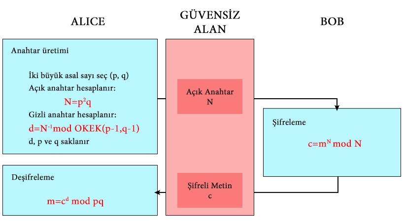

## Hakkında

* Girdi olarak bulunduğu dizindeki plaintext.txt dosyasını alır.
* Kullanıcıdan anahtar uzunluğu istenir. Bu uzunluk plaintext.txt dosyasındaki metinden en az 4 kat büyük olmalıdır. Aksi taktirde metin kaybedilir.

## Yapı

* **keygen(n)** fonksiyonu publickey.txt ve privatekey.txt dosyaları oluşturur. Bu dosyalara Schmidt Samoa asimetrik şifreleme yöntemi ile oluşturduğu public key ve private key değerlerini yazar.
* **encrypt(plaintext, publickey)** fonksiyonu plaintext.txt dosyası içerisinde yer alan metni publickey.txt dosyası içinde oluşturulmuş olan public key ile şifreleyip ciphertext.txt dosyasına yazar.
* **decrypt(ciphertext, privatekey)** fonksiyonu ciphertext.txt dosyası içindeki metni privatekey.txt dosyası içindeki private key ile deşifreleyip plaintext2.txt dosyasına yazar. plaintext.txt ve plaintext2.txt dosyalarını karşılaştırıp özdeş olup olmadıklarını çıktı olarak vermektedir.

